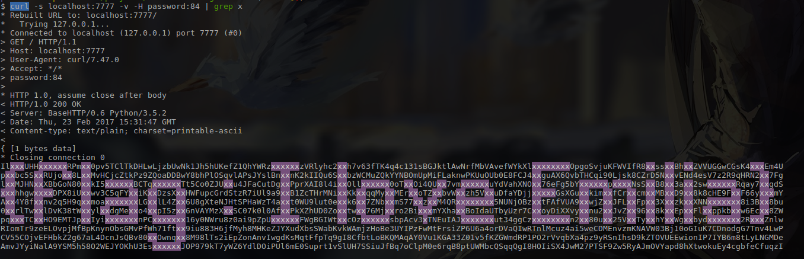

I Love Emilia
=============

Car Brand is a nice person. He wants to declare his love to his girl. Unfortunately, another trash girl also likes him. In order to announce to the trash girl about his feelings, he decides to put his confession into irrefutable words, and send it to everyone. The trash girl intercepts the message, but is unable to open it. Can you help the trash girl realise the feeling of Car Brand?

Brownie points to those who know what anime I am making this reference from and who both the girls are.

- Category : #misc

- Requirements : http request, devious mind, patience, brute force partially required.

- link - defunct

- Flag Format : { flag : <flag> }

Provided [server.py](server.py)

Solution
========

To solve this question, you are required to send a query at the port and host that the server is setup on. So let us try that out. For this example, server is setup on localhost:7777.

    $ curl localhost:7777 -v
	* Rebuilt URL to: localhost:7777/
	*   Trying 127.0.0.1...
	* Connected to localhost (127.0.0.1) port 7777 (#0)
	> GET / HTTP/1.1
	> Host: localhost:7777
	> User-Agent: curl/7.47.0
	> Accept: */*
	> 
	* HTTP 1.0, assume close after body
	< HTTP/1.0 200 OK
	< Server: BaseHTTP/0.6 Python/3.5.2
	< Date: Thu, 23 Feb 2017 15:17:14 GMT
	< Content-type: text/plain; charset=printable-ascii
	< 
	* Closing connection 0
	Header password missing%                                                                                             

So there is something fishy in the headers. It speaks of a charset=`printable-ascii`. It also says that a header `password` is missing.

	$ curl localhost:7777 -v -H password:password
	* Rebuilt URL to: localhost:7777/
	*   Trying 127.0.0.1...
	* Connected to localhost (127.0.0.1) port 7777 (#0)
	> GET / HTTP/1.1
	> host: localhost:7777
	> User-Agent: curl/7.47.0
	> Accept: */*
	> password:password
	> 
	* HTTP 1.0, assume close after body
	< HTTP/1.0 200 OK
	< Server: BaseHTTP/0.6 Python/3.5.2
	< Date: Thu, 23 Feb 2017 15:18:24 GMT
	< Content-type: text/plain; charset=printable-ascii
	< 
	* Closing connection 0
	uint8 expected%   

So we make a guess with the password `password`, which is as good as any to start, and we see that it points out that a unit8 is expected.

	$ curl localhost:7777 -v -H password:10
	* Rebuilt URL to: localhost:7777/
	*   Trying 127.0.0.1...
	* Connected to localhost (127.0.0.1) port 7777 (#0)
	> GET / HTTP/1.1
	> Host: localhost:7777
	> User-Agent: curl/7.47.0
	> Accept: */*
	> password:10
	> 
	* HTTP 1.0, assume close after body
	< HTTP/1.0 200 OK
	< Server: BaseHTTP/0.6 Python/3.5.2
	< Date: Thu, 23 Feb 2017 15:25:54 GMT
	< Content-type: text/plain; charset=printable-ascii
	< 

	N,��H�w�doc�� ���^���`���$U��U�B�E
    ...
    ...
    ...
    ������6��#��|���S�
	
	* Closing connection 0

So we get a garbage, binary output, for a password of 10. On doing a little bruteforce, we get the following.

	$ curl localhost:7777 -v -H password:84
	* Rebuilt URL to: localhost:7777/
	*   Trying 127.0.0.1...
	* Connected to localhost (127.0.0.1) port 7777 (#0)
	> GET / HTTP/1.1
	> Host: localhost:7777
	> User-Agent: curl/7.47.0
	> Accept: */*
	> password:84
	> 
	* HTTP 1.0, assume close after body
	< HTTP/1.0 200 OK
	< Server: BaseHTTP/0.6 Python/3.5.2
	< Date: Thu, 23 Feb 2017 15:28:23 GMT
	< Content-type: text/plain; charset=printable-ascii
	< 

	IlxxxUHHxxxxxxRPmxx0pv5TClTkDHLwLjzbUwNk1Jh5hUKefZ1QhYWRzxxxxxxzVRlyhc2xxh7v63fTK4q4c131sBGJktlAwNrfMbVAvefWYkXlxxxxxxxxOpgoSvjuKFWVIfR8xxssxxBhxxZVVUGGwCGsK4xxxEm4U
	pxxbc5SxxRUjoxx8LxxMvHCjcZtkPz9ZQoaDDBwY8bhPlOSqvlAPsJYslBnxxnK2kIIQu6SxxbzWCMuZQkYYNBOmUpMiFLaknwPKUuOUb0E8FCJ4xxguAX6QvbTHCqi90Ljsk8CZrD5NxxvENd4esV7z2R9qHRN2xx7Fg
	lxxMJHNxxXBbGoN80xxkI5xxxxxxBCTqxxxxxxTt5Co0ZJUxxu4JFaCutDgxxPprXAI8l4ixxOllxxxxxx0oTxxOi4QUxx7vmxxxxxxuYdVahXNOxx76eFg5bYxxxxxxpxxxxNsSxxB8xx3axx2swxxxxxxRqay7xxgdS
	xxxhhgwxxxxDPX8iUxxwv3C5qFYxxiKxxDzsXxxHWFupcGrdStzR7iUl9a9xxB1ZcTHrMNixxKkxxqqMyxxMErxxoTZxxbvWxxzh5VxxuDfaYDjjxxxxxGsXGuxxkimxxfCrxxcmxxMBxxD9xx8k8cHE9FxxF66yxxxmY
	Axx4Y8fxxnv2q5H9qxxmoaxxxxxxxLGxxlL4Zxx6U8gXteNJHtSPHaWzT4axxt0WU9lut0exxk6xx7ZNbxxmS77xxzxxM4QRxxxxxxxx5NUNjOBzxxtFAfVUA9xxwjZxxJFLxxFpxx3XxxzkxxXNNxxxxxxx8i3Bxx8bu
	0xxrlTwxxlDvK38tWxxylxxdgMexxo4xxpI5zxx6nVAYMzXxxSC07k0l0AfxxPkXZhUD0Zoxxtwxx76Mjxxro2BixxxmYXhaxxBoIdaUTbyUzr7CxxoyDiXXvyxxnu2xxJvZxx96xx8kxxEpxxFlxxppkbxxw6Ecxx8ZW
	pqxxxTCxxHO9EMTJpxxIyixxxxxxxnPCxxxxxxx16y0NWru8z0ai9pZpUxxxxxxFWgBGIWtxxcOzxxxxxxsbpAcv3xTNEuIAJxxxxxxxut34ggCzxxxxxxxxn2xx80uxx25VxxTyxxhYxxWgxxbydxxxxxxx2RxxxZnlw
	RIomTr9zeELOvpjMfBpKnynObsGMvPfWh71ftxx9iu883H6jfMyh8MHKeZJYXudXbsSWabKvkWAmjzHoBe3UYIPzFwMtFrsiZP6U6a4orDVaQIwRTnlMcuz4ai5weCDMEnvzmKNAVW03Bj10oGIuK7CDnodgG7Tnv4LwP
	CV55COjvEFHbkZ2g67aL4DcnJsQBv80xxOwnqxx8M98lTs2iEpZonAnvIwgdKsMqtFfpTq9gI8CfbtLoBKQMAqAY0Vu1KGA33Z01v5fKZGWmdRP1PO2rVvqbXa4pz9yRSnIhsD9kZTOVUEEwionIP7IYB6m8tLyLNGMDe
	AmvJYyiNalA9YSM5h58O2WEJYOKhU3EsxxxxxxJOP979kT7yWZ6YdlDOiPUl6mE0Suprt1vSlUH7SSiuJfBq7oClpM0e6rqB8ptUWMbcQSqqQgI8HOIiSX4JwM27PTSF9Zw5RyAJmOVYapd8hXtwokuEy4cgbfeCfuqzI
	9lIJEm8DMsnL2TJMRrUo57pipc6yI7cTQLLRnMXyibP6jtTOw1P19UgylNoR54RyK12itLkj8ZyTJtsHZV8hUcX47Inp1TcZJyrmMTnFBAAcLIiUCKuBWMNOErnc0GIf5c5JG4mTlccfklIza1rXGDs7rcmZ8XkVQKR5q
	* Closing connection 0

Which is the only printable-ascii output that we get from the password. But it is still not done. But I see that there are a lot of 'x' characters in this file. Let's highlight that.

Flag
====
I love Emilia