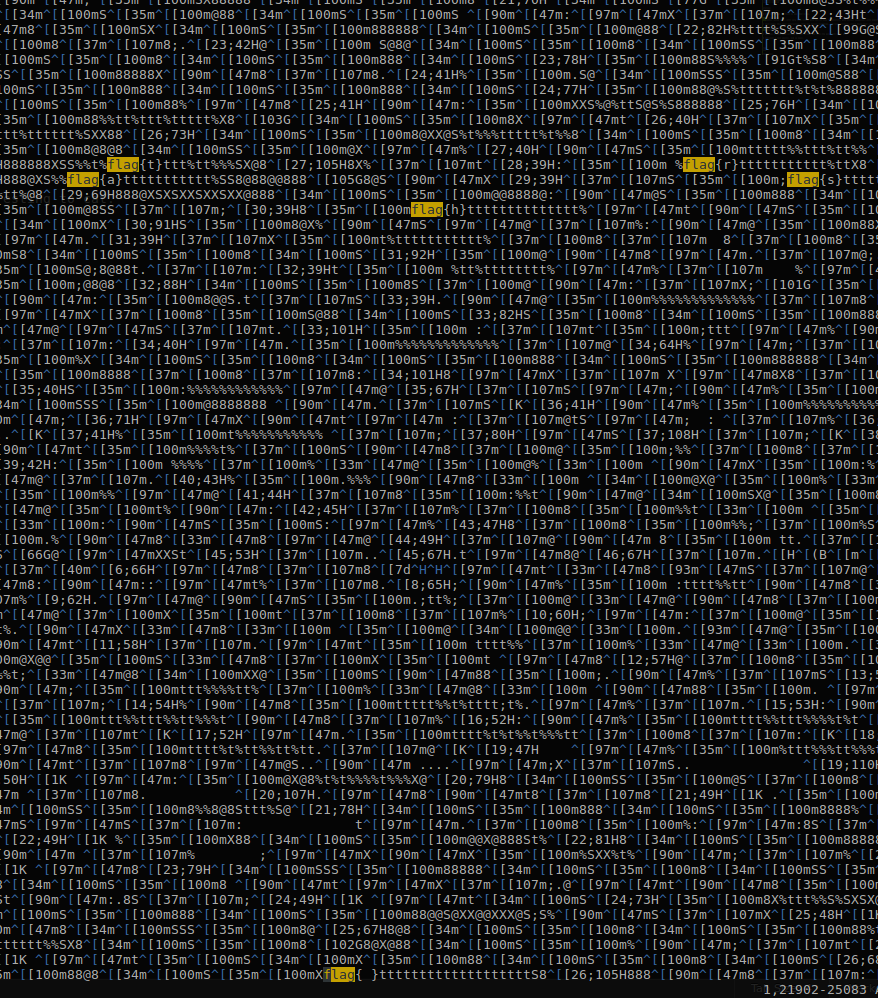

I Love Emilia
=============

Find the flag that has been going viral all over Facebook.

- Flag Format: /flag{.+}/

- Category : #misc, #stegno

Provided [media](media)
Provided [media2 -- Easier](media2)

Solution
========

We try to inspect the file to see what it is. 

	$ file media
	media: ASCII text, with very long lines, with CR, LF line terminators, with escape sequences, with overstriking

So that makes this file interesting. This has escape sequences, and over striking, which means that it should be interesting to cat.

	$ cat media
	flag{e}

So we have a trash dove printed on the screen, and then the ascii art fades off.

We now need a text editor. Vim is best.

So there seem to a few text entries scattered in the file. Let us get all of them out.

	$ grep -o flag\{.\} media
	flag{t}
	flag{r}
	flag{a}
	flag{s}
	flag{h}
	flag{ }
	flag{d}
	flag{o}
	flag{v}
	flag{e}

media2, which makes things easier is just media concatinated with itself a few times.

	$ grep -o flag\{.\} media2
	flag{t}
	flag{r}
	flag{a}
	flag{s}
	flag{h}
	flag{ }
	flag{d}
	flag{o}
	flag{v}
	flag{e}
	flag{t}
	flag{r}
	flag{a}
	flag{s}
	flag{h}
	flag{ }
	flag{d}
	flag{o}
	flag{v}
	flag{e}
	flag{t}
	flag{r}
	flag{a}
	flag{s}
	flag{h}
	flag{ }
	flag{d}
	flag{o}
	flag{v}
	flag{e}
	flag{t}
	flag{r}
	flag{a}
	flag{s}
	flag{h}
	flag{ }
	flag{d}
	flag{o}
	flag{v}
	flag{e}
	flag{t}
	flag{r}
	flag{a}
	flag{s}
	flag{h}
	flag{ }
	flag{d}
	flag{o}
	flag{v}
	flag{e}
	flag{t}
	flag{r}
	flag{a}
	flag{s}
	flag{h}
	flag{ }
	flag{d}
	flag{o}
	flag{v}
	flag{e}
	flag{t}
	flag{r}
	flag{a}
	flag{s}
	flag{h}
	flag{ }
	flag{d}
	flag{o}
	flag{v}
	flag{e}
	flag{t}
	flag{r}
	flag{a}
	flag{s}
	flag{h}
	flag{ }
	flag{d}
	flag{o}
	flag{v}
	flag{e}
	flag{t}
	flag{r}
	flag{a}
	flag{s}
	flag{h}
	flag{ }
	flag{d}
	flag{o}
	flag{v}
	flag{e}
	flag{t}
	flag{r}
	flag{a}
	flag{s}
	flag{h}
	flag{ }
	flag{d}
	flag{o}
	flag{v}
	flag{e}
	flag{t}
	flag{r}
	flag{a}
	flag{s}
	flag{h}
	flag{ }
	flag{d}
	flag{o}
	flag{v}
	flag{e}
	flag{t}
	flag{r}
	flag{a}
	flag{s}
	flag{h}
	flag{ }
	flag{d}
	flag{o}
	flag{v}
	flag{e}
	flag{t}
	flag{r}
	flag{a}
	flag{s}
	flag{h}
	flag{ }
	flag{d}
	flag{o}
	flag{v}
	flag{e}
	flag{t}
	flag{r}
	flag{a}
	flag{s}
	flag{h}
	flag{ }
	flag{d}
	flag{o}
	flag{v}
	flag{e}
	flag{t}
	flag{r}
	flag{a}
	flag{s}
	flag{h}
	flag{ }
	flag{d}
	flag{o}
	flag{v}
	flag{e}
	flag{t}
	flag{r}
	flag{a}
	flag{s}
	flag{h}
	flag{ }
	flag{d}
	flag{o}
	flag{v}
	flag{e}
	flag{t}
	flag{r}
	flag{a}
	flag{s}
	flag{h}
	flag{ }
	flag{d}
	flag{o}
	flag{v}
	flag{e}
	flag{t}
	flag{r}
	flag{a}
	flag{s}
	flag{h}
	flag{ }
	flag{d}
	flag{o}
	flag{v}
	flag{e}
	flag{t}
	flag{r}
	flag{a}
	flag{s}
	flag{h}
	flag{ }
	flag{d}
	flag{o}
	flag{v}
	flag{e}
	flag{t}
	flag{r}
	flag{a}
	flag{s}
	flag{h}
	flag{ }
	flag{d}
	flag{o}
	flag{v}
	flag{e}
	flag{t}
	flag{r}
	flag{a}
	flag{s}
	flag{h}
	flag{ }
	flag{d}
	flag{o}
	flag{v}
	flag{e}

Flag
====

trash dove